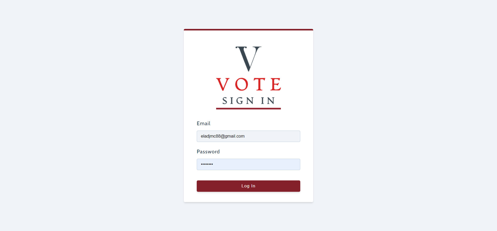
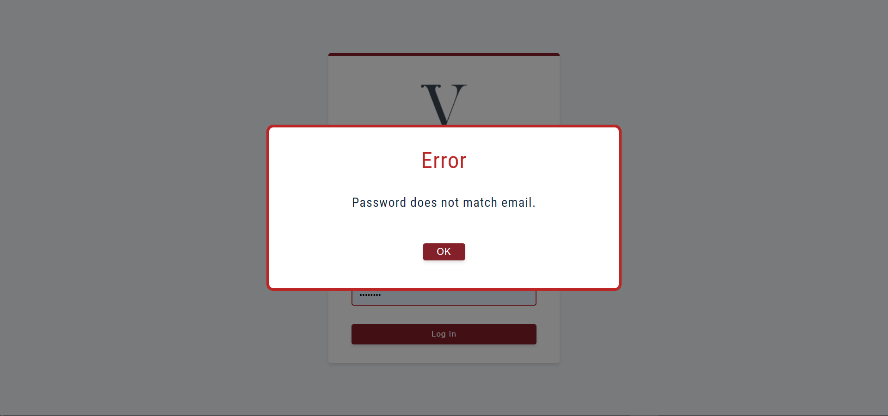
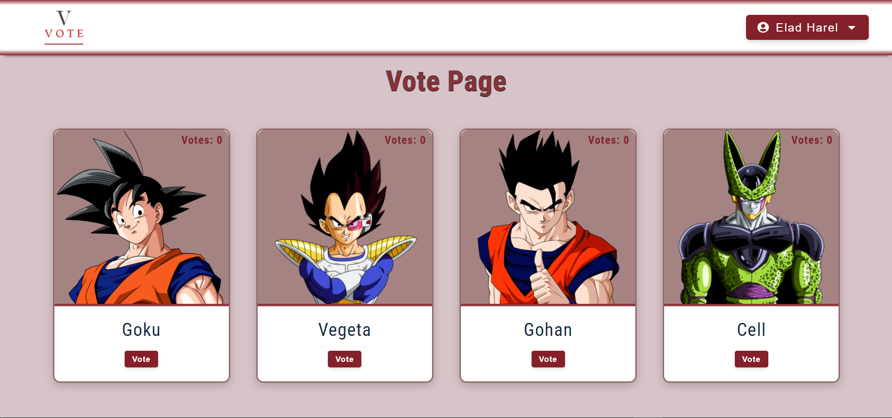
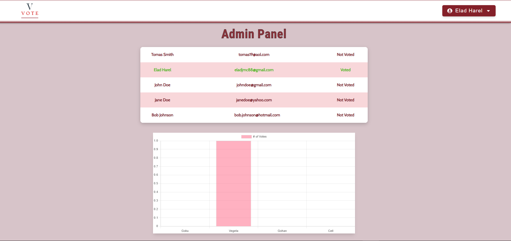
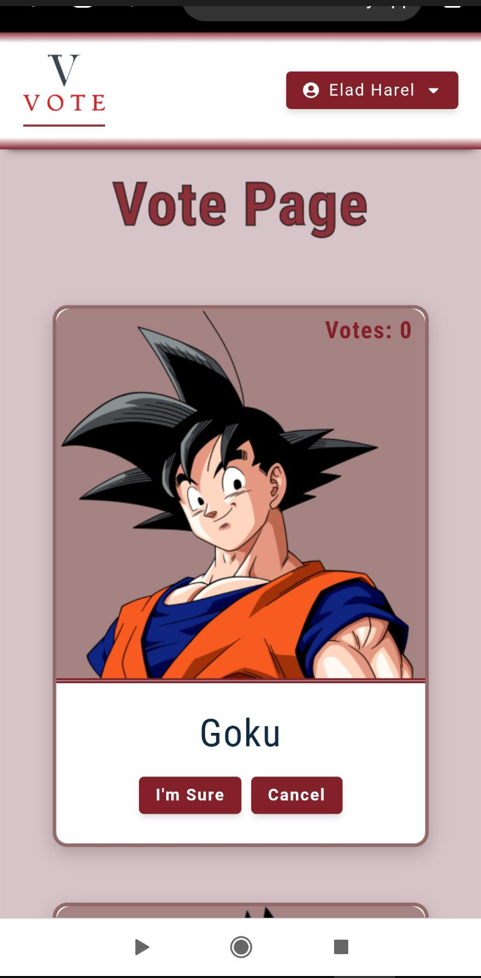
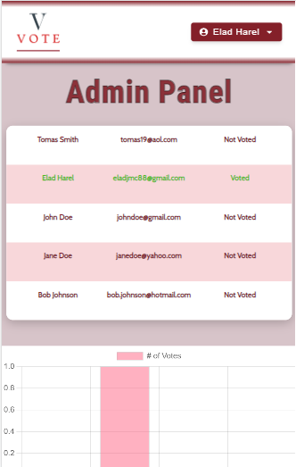

# ✋ React Voting App
I was given a task @AppleSeeds Bootcamp to make a React App with two type of users - admin and regular user. in the app all users can vote for one of the dragon ball series characters and the admin users can view statistics and data graph.

### Instructions:
<a href="instructions.pdf" target="_blank">Instructions-PDF</a>
<br />

## My design was simple and I made sure to include 3 pages:


### `Login Page`
In this page you need to insert a valid email and password (that is already in the data) in order to login.
once you are logged in you can logout using the logout option. however the state for logged users is saved, so refreshing the page will not log you out.


 

<br>

 

### `Vote Page`
In this page all users can vote, once a vote was made you will be asked if you are sure about your vote, even after finish voting you can still take your vote back.
All the candidates have the total number of vote showed to the user.

 

<br>

### `Admin panel`
In this page admin users can view a table of all registered users and if they voted or not, moreover there is a graph in the page that visualize the state of the votes

 


<hr>

<br>

### `Navbar`
All pages can be rendered as long as you have the suited type of user to display them.
the navbar have a dropdown window that have all the pages, moreover it has a logout button.


<br>


## `App responsiveness`
I made sure that the app is useable for smaller screens.

 


 

<br />


## Demo site link

https://elad-vote-app.netlify.app/


<br />


## Deployment
in order to run the app locally you will need to install all the dependencies from the package.json file.  
run the command ``` npm install ``` to install all the dependencies, after it's done you can run ``` npm start``` to start the app locally in ```localhost:3000```


## More Available Scripts

In the project directory, you can run:

### `npm start`

Runs the app in the development mode.\
Open [http://localhost:3000](http://localhost:3000) to view it in your browser.

The page will reload when you make changes.\
You may also see any lint errors in the console.

### `npm test`

Launches the test runner in the interactive watch mode.\
See the section about [running tests](https://facebook.github.io/create-react-app/docs/running-tests) for more information.

### `npm run build`

Builds the app for production to the `build` folder.\
It correctly bundles React in production mode and optimizes the build for the best performance.

The build is minified and the filenames include the hashes.\
Your app is ready to be deployed!

See the section about [deployment](https://facebook.github.io/create-react-app/docs/deployment) for more information.

### `npm run eject`

**Note: this is a one-way operation. Once you `eject`, you can't go back!**

If you aren't satisfied with the build tool and configuration choices, you can `eject` at any time. This command will remove the single build dependency from your project.

Instead, it will copy all the configuration files and the transitive dependencies (webpack, Babel, ESLint, etc) right into your project so you have full control over them. All of the commands except `eject` will still work, but they will point to the copied scripts so you can tweak them. At this point you're on your own.

You don't have to ever use `eject`. The curated feature set is suitable for small and middle deployments, and you shouldn't feel obligated to use this feature. However we understand that this tool wouldn't be useful if you couldn't customize it when you are ready for it.

## Some Valid Emails+Passwords to play around with the app
Mail: ```tomas19@aol.com``` Password: ```1234``` type: ```User```

Mail: ```alicelee@gmail.com``` Password: ```2NDJYFL``` type: ```Admin```

# Conclusion:
after running the ```npm install``` and ```npm start``` commands you should have the project running locally.  
If you liked it, feel free to fork/clone and play around with the code. 
